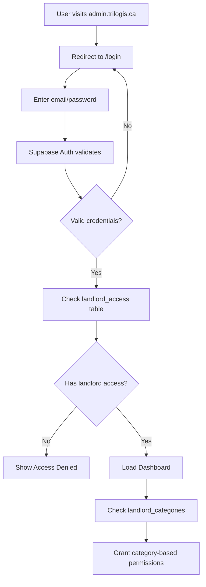

# Project Summary: Tri-Logis Landlord Portal

## ✅ What Was Built

A complete **landlord portal** for Tri-Logis property management, deployed to **admin.trilogis.ca**.

### Key Features

- ✅ **Landlord Authentication**: Secure login via Supabase Auth with landlord access verification
- ✅ **Role-Based Access Control**: Checks `portal_auth.landlord_access` table
- ✅ **Category-Based Permissions**: Supports landlord categories from `portal_auth.landlord_categories`
- ✅ **Same Tech Stack**: Uses identical Supabase instance as tenant portal
- ✅ **Production Ready**: Complete with deployment guides, monitoring, and backups

---

## 📂 Repository Structure

```
admin.trilogis.ca/
├── src/
│   ├── app/
│   │   ├── api/landlord/profile/    # API endpoints
│   │   ├── dashboard/               # Main dashboard (auth required)
│   │   ├── login/                   # Login page
│   │   ├── layout.tsx               # Root layout with SessionProvider
│   │   └── page.tsx                 # Root redirect
│   ├── components/
│   │   └── providers/
│   │       └── SessionProvider.tsx  # Auth context provider
│   └── lib/
│       ├── services/
│       │   └── portal-service.ts    # Landlord access verification
│       └── supabase/
│           ├── client.ts            # Browser client
│           ├── server.ts            # Server client
│           └── service-role-client.ts
├── .env.example                     # Environment template
├── DEPLOYMENT-GUIDE.md              # Complete deployment instructions
├── QUICK-START.md                   # Quick local setup
├── README.md                        # Project overview
└── package.json
```

---

## 🔐 Authentication Flow



---

## 🗄️ Database Requirements

The portal requires these tables in your Supabase `portal_auth` schema:

### 1. landlord_access
```sql
CREATE TABLE portal_auth.landlord_access (
  user_id UUID PRIMARY KEY REFERENCES auth.users(id),
  granted_at TIMESTAMPTZ NOT NULL DEFAULT NOW(),
  revoked_at TIMESTAMPTZ
);
```

**Purpose**: Grant/revoke landlord portal access

### 2. landlord_categories
```sql
CREATE TABLE portal_auth.landlord_categories (
  id UUID PRIMARY KEY DEFAULT gen_random_uuid(),
  user_id UUID NOT NULL REFERENCES auth.users(id),
  category TEXT NOT NULL,
  granted_at TIMESTAMPTZ NOT NULL DEFAULT NOW(),
  revoked_at TIMESTAMPTZ
);
```

**Purpose**: Define what categories a landlord can access
- Use `'*'` for all categories
- Use specific category names for limited access

### 3. profiles
```sql
CREATE TABLE portal_auth.profiles (
  id UUID PRIMARY KEY REFERENCES auth.users(id),
  email TEXT,
  first_name TEXT,
  last_name TEXT,
  phone TEXT,
  created_at TIMESTAMPTZ NOT NULL DEFAULT NOW(),
  updated_at TIMESTAMPTZ NOT NULL DEFAULT NOW()
);
```

**Purpose**: Store user profile information

---

## 🚀 Deployment Overview

### Option 1: Production Server (Recommended)

Deploy to **admin.trilogis.ca** using:
- **Server**: Ubuntu/Debian VPS
- **Process Manager**: PM2
- **Web Server**: Nginx (reverse proxy)
- **SSL**: Let's Encrypt via Certbot
- **Backups**: Automated daily backups
- **Monitoring**: PM2 + Nginx logs

**See**: `DEPLOYMENT-GUIDE.md` for complete step-by-step instructions

### Option 2: Vercel/Netlify (Alternative)

Quick deployment:
```bash
# Deploy to Vercel
vercel --prod

# Or Netlify
netlify deploy --prod
```

Add environment variables in platform dashboard:
- `NEXT_PUBLIC_SUPABASE_URL`
- `NEXT_PUBLIC_SUPABASE_ANON_KEY`
- `SUPABASE_SERVICE_ROLE_KEY`

---

## 📋 Quick Start Checklist

### Local Development

- [ ] Clone repository
- [ ] Run `npm install`
- [ ] Copy `.env.example` to `.env.local`
- [ ] Add Supabase credentials
- [ ] Run `npm run dev`
- [ ] Visit http://localhost:3000
- [ ] Login with landlord user

### Production Deployment

- [ ] Create remote Git repository
- [ ] Push code to remote
- [ ] SSH into admin.trilogis.ca
- [ ] Install Node.js, PM2, Nginx
- [ ] Clone repository to `/var/www/admin.trilogis.ca`
- [ ] Create `.env.production`
- [ ] Build and start with PM2
- [ ] Configure Nginx reverse proxy
- [ ] Setup SSL with Certbot
- [ ] Configure firewall (UFW)
- [ ] Setup automated backups
- [ ] Test authentication

---

## 🔧 Tech Stack

| Technology | Version | Purpose |
|------------|---------|---------|
| Next.js | 14.2.32 | React framework (App Router) |
| React | 18.2.0 | UI library |
| TypeScript | 5.3.3 | Type safety |
| Supabase | 2.39.3 | Auth & Database |
| Tailwind CSS | 3.4.0 | Styling |
| PM2 | Latest | Process management |
| Nginx | Latest | Reverse proxy |

---

## 🎯 What Makes This Different from Tenant Portal

| Feature | Tenant Portal | Landlord Portal (admin.trilogis.ca) |
|---------|---------------|-------------------------------------|
| **Access** | All authenticated users | Only users in `landlord_access` table |
| **URL** | trilogis.ca/portal/tenant | admin.trilogis.ca |
| **Repository** | Part of main monorepo | Separate standalone repository |
| **Database** | Same Supabase instance | Same Supabase instance |
| **Auth System** | Supabase Auth | Supabase Auth (same) |
| **Permissions** | Everyone has access | Category-based via `landlord_categories` |

---

## 📝 Key Files Explained

### Authentication & Access Control

**`src/lib/services/portal-service.ts`**
- Checks `landlord_access` table using service-role client
- Loads landlord categories
- Bypasses RLS for system-level auth checks

**`src/app/dashboard/layout.tsx`**
- Server component that guards dashboard routes
- Calls `detectUserPortals()` to verify landlord access
- Shows "Access Denied" if user lacks landlord access

### Supabase Clients

**`src/lib/supabase/client.ts`** (Browser)
- Client-side Supabase client
- Used in React components
- Cookie-based session management

**`src/lib/supabase/server.ts`** (Server)
- Server-side Supabase client
- Used in Server Components and API routes
- Reads cookies from Next.js headers

**`src/lib/supabase/service-role-client.ts`** (Admin)
- Admin client that bypasses RLS
- Used only for auth checks in `portal-service.ts`
- Never exposed to client

---

## 🔒 Security Features

1. **Environment Variables**: Secrets stored in `.env.production` (chmod 600)
2. **Service Role Protection**: Admin key never sent to client
3. **RLS Policies**: Enforced at database level
4. **Rate Limiting**: Login endpoint limited to 5 requests/minute
5. **Security Headers**: X-Frame-Options, CSP, XSS protection
6. **HTTPS Only**: SSL certificate via Let's Encrypt
7. **Firewall**: UFW configured (SSH + HTTP/HTTPS only)

---

## 📊 Monitoring & Maintenance

### View Logs
```bash
# Application logs
pm2 logs admin-trilogis

# Nginx access logs
sudo tail -f /var/log/nginx/access.log

# Nginx error logs
sudo tail -f /var/log/nginx/error.log
```

### Check Status
```bash
# PM2 status
pm2 status

# Nginx status
sudo systemctl status nginx

# Disk usage
df -h

# Check backups
ls -lh /var/backups/admin-trilogis/
```

### Update Application
```bash
cd /var/www/admin.trilogis.ca
git pull origin main
npm install --production
npm run build
pm2 reload admin-trilogis
```

---

## 🎓 Next Steps

### Immediate
1. **Setup Remote Repository**: Push to GitHub/GitLab
2. **Deploy to Server**: Follow `DEPLOYMENT-GUIDE.md`
3. **Test Authentication**: Create test landlord user
4. **Verify Access Control**: Test with non-landlord user

### Short Term
1. Add dashboard features (properties, tenants, reports)
2. Create API endpoints for landlord operations
3. Build UI components for data management
4. Add analytics and reporting

### Long Term
1. Implement advanced permissions (read/write/admin)
2. Add audit logging
3. Build notification system
4. Create mobile responsive views
5. Add multi-language support

---

## 📚 Documentation Files

| File | Purpose |
|------|---------|
| `README.md` | Project overview and setup |
| `QUICK-START.md` | Get running in 5 minutes |
| `DEPLOYMENT-GUIDE.md` | Complete production deployment |
| `PROJECT-SUMMARY.md` | This file - high-level overview |
| `.env.example` | Environment variable template |

---

## 🆘 Getting Help

### Common Issues

**"Access Denied" after login**
→ Check `portal_auth.landlord_access` table

**Environment variables not loading**
→ Ensure `.env.local` exists and restart dev server

**502 Bad Gateway**
→ Check if application is running with `pm2 status`

**SSL certificate errors**
→ Renew with `sudo certbot renew`

### Resources

- Supabase Docs: https://supabase.com/docs
- Next.js Docs: https://nextjs.org/docs
- PM2 Docs: https://pm2.keymetrics.io/docs
- Nginx Docs: https://nginx.org/en/docs

---

## ✨ Summary

You now have a **production-ready landlord portal** that:
- ✅ Authenticates via Supabase Auth
- ✅ Verifies landlord access from `portal_auth` schema
- ✅ Uses same tech stack as tenant portal
- ✅ Is ready to deploy to admin.trilogis.ca
- ✅ Has comprehensive deployment documentation
- ✅ Includes monitoring, backups, and security

**Repository**: `/Users/cedriclajoie/Project/cs50/admin.trilogis.ca`
**Git Commits**: 2 commits, ready to push
**Production URL** (after deployment): https://admin.trilogis.ca

---

## 🙏 Credits

Built using:
- Next.js by Vercel
- Supabase for auth & database
- Tailwind CSS for styling
- PM2 for process management
- Nginx for reverse proxy
